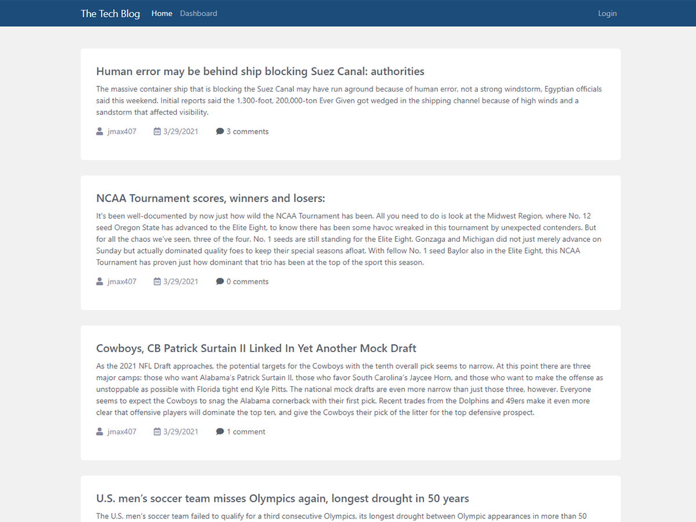

# The Tech Blog  
  

# Screenshot

# Description
A CMS style blog site, where developers can publish their blog posts and comment on developers' post as well. This app follows the MVC paradigm in its architectural structure, using Handlebars.js as the templating language, Sequelize as the ORM, and the express-session npm package for authentication.

# Table of Contents
*[Demo](#demo)  
*[Technology](#technology)  
*[Features](#features)  
*[Installation](#installation)  
*[Usage](#usage)  
*[Contribute](#contribute)  
*[Tests](#tests)  
*[Questions](#questions)  
*[License](#license)

# Demo
[DEMO: The Tech Blog](n/a)

# Technology 
| Technology | Description                        |Links ↘️ |
| ---------- | -----------------------------------| ------|  
|  | HTML, CSS, Javascript, MYSQL |  |

# Features
users are able to create accounts, post, update previous post, delete post and comment on posts.

# Installation  
Project Repository: [The Tech Blog](https://github.com/jmax407/tech-blog)  
all dependencies call be install through npm: bcrypt, connect-session-sequelize, dotenv, express, express-handlebars, express-session, handlebars, mysql2, sequelize 

# Usage
[The Tech Blog](https://fierce-anchorage-14790.herokuapp.com/)  
when starting the site, you'll be prompted to login or create an account. Once you create an account click on dashboard to upload a new post. or click on a previous post to comment on it.

# Contribute 
n/a

# Tests
npm jest

# Questions
Feel free to reach out if you have any questions

Contact via GitHub: [jmax407](https://github.com/jmax407)  
Send an email: [jmax407@gmail.com](mailto:jmax407@gmail.com)

# License
None
